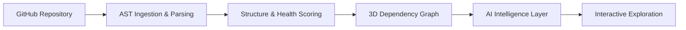
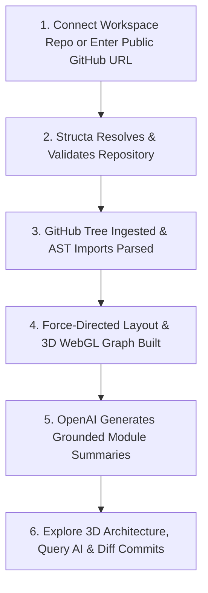

# Structa

> **Understand any codebase. Before you touch the code.**

[](https://nextjs.org/)
[](https://react.dev/)
[](https://www.typescriptlang.org/)
[](https://threejs.org/)
[](https://www.mongodb.com/)
[](https://openai.com/)
[](https://vercel.com/)
[](#project-status)

Structa is an **open-source AI-powered platform for understanding complex GitHub repositories**. It transforms a codebase from a disconnected tree of files and directories into an intuitive, visual, interactive, and AI-assisted intelligence layer.

Instead of spending hours manually reading `README` files, tracing deep import chains across nested directories, and piecing together system boundaries, Structa extracts code structure, computes multi-dimensional module dependencies, visualizes architecture in **3D**, and surfaces repository-grounded AI insights.

Whether you are onboarding to a massive production repository, exploring an unfamiliar open-source project, evaluating third-party libraries, or reviewing architectural changes across commits, Structa equips you with system-level comprehension before you write a single line of code.

---

### 🌐 Live Demo

Experience Structa live in your browser:

🔗 **[https://structa-blush.vercel.app/](https://structa-blush.vercel.app/)**

*Note: Accessing private repositories and connected team workspaces requires signing in via GitHub OAuth. Public repository exploration in Explorer Mode is accessible instantly.*

---

## 📋 Table of Contents

- [Vision](#vision)
- [The Problem](#the-problem)
- [The Solution](#the-solution)
- [Core Features](#core-features)
  - [GitHub Integration](#github-integration)
  - [AST Parsing & Repository Analysis](#ast-parsing--repository-analysis)
  - [Interactive 3D Dependency Graph](#interactive-3d-dependency-graph)
  - [Public Repository Explorer Mode](#public-repository-explorer-mode)
  - [Grounded AI Intelligence Layer](#grounded-ai-intelligence-layer)
  - [Advanced Workspace Intelligence](#advanced-workspace-intelligence)
  - [Role-Based Security & Governance](#role-based-security--governance)
- [Why Structa?](#why-structa)
- [Who Is Structa For?](#who-is-structa-for)
- [How It Works](#how-it-works)
- [System Architecture](#system-architecture)
- [Tech Stack](#tech-stack)
- [Project Structure](#project-structure)
- [Getting Started](#getting-started)
  - [Prerequisites](#prerequisites)
  - [Installation](#installation)
  - [Environment Variables](#environment-variables)
  - [Development Server](#development-server)
  - [Production Build](#production-build)
- [Deployment](#deployment)
- [Project Status](#project-status)
- [Roadmap & Milestones](#roadmap--milestones)
- [Open Source Philosophy](#open-source-philosophy)
- [Contributing](#contributing)
- [License](#license)
- [FAQ](#faq)

---

## 🔭 Vision

> **Make software architecture understandable at a glance.**

When developers inherit unfamiliar repositories, they face cognitive overload. A repository is typically presented as a static directory tree filled with hundreds of source files, implicit dependencies, and hidden architectural conventions.

Structa’s vision is to bridge the gap between human mental models and codebase reality. By unifying static AST analysis, force-directed 3D visual graph layouts, real-time commit diffing, and grounded large language model (LLM) intelligence, Structa aims to become the definitive understanding and exploration layer for the global developer ecosystem.

---

## ⚠️ The Problem

- **High Onboarding Friction**: Engineers spend days or weeks reading files individual-by-individual just to grasp basic component boundaries and request flows.
- **Hidden Structural Complexity**: Circular dependencies, tightly coupled modules, and monolithic files remain invisible in traditional file trees until they cause runtime failures or refactoring headaches.
- **Fragmented Context**: Standard AI assistants can answer isolated code questions, but they lack repository-wide structural awareness and spatial dependency context.
- **Outdated Architecture Docs**: Manual diagrams and `README` architectural summaries rot quickly as codebases evolve, leading to dangerous design misunderstandings.
- **Open-Source Evaluation Overhead**: Exploring third-party libraries on GitHub requires manual cloning or basic file browsing, making it difficult to judge code quality and maintainability quickly.

---

## 💡 The Solution

Structa approaches codebase intelligence systematically by ingesting repositories, computing dependency graphs, generating grounded module summaries, and providing a dynamic 3D workspace.



1. **Ingestion**: Fetches directory structures and file contents via GitHub REST APIs.
2. **Parsing**: Extracts JavaScript/TypeScript import relationships (ES Modules, CommonJS `require`, dynamic `import()`, re-exports), calculates lines of code (LOC), and computes cyclomatic complexity.
3. **Graphing**: Computes 3D spherical spatial coordinates using server-side force-directed layout positioning.
4. **AI Intelligence**: Summarizes module responsibilities with OpenAI `gpt-4o-mini` and powers real-time streaming Q&A with module-level citations.
5. **Exploration**: Renders interactive 3D WebGL scenes for visual navigation, architectural diffing, and circular dependency detection.

---

## ✨ Core Features

Structa offers two complementary operating modes: **Workspace Mode** (for team repositories and authenticated GitHub account management) and **Explorer Mode** (for instant analysis of any public GitHub repository supported by a shared cache).

### 🔑 GitHub Integration
- **GitHub OAuth Authentication**: Authenticate via GitHub OAuth managed by Clerk.
- **Organization & Personal Repo Discovery**: Browse personal and organization repositories directly within the connection drawer.
- **Private Repository Support**: Securely sync and analyze private team repositories with encrypted access tokens.
- **Public Repository Search**: Search any public GitHub repository by name, author, or full URL (`https://github.com/owner/repo` or `owner/repo`).

### 🧬 AST Parsing & Repository Analysis
- **Comprehensive JS/TS Parsing**: Handles ES6 `import`/`export`, CommonJS `require()`, dynamic imports, type-only imports, and file re-exports.
- **Repository Health Score**: Calculates an overall repository health score (0–100%) based on modularity, LOC distribution, and coupling metrics.
- **Complexity Analysis**: Computes per-module lines of code (LOC) and complexity scores to pinpoint high-risk files.

### 🌐 Interactive 3D Dependency Graph
- **React Three Fiber (R3F) Canvas**: High-performance 3D WebGL graph rendering built on Three.js.
- **Dynamic Node Geometries**: Visual distinction between folders (Ion Blue spheres) and source files (Slate spheres), sized dynamically by LOC and complexity.
- **Curved 3D Bezier Edges**: Directional lines connecting importing modules to dependency files.
- **Camera Fly-To Controls**: Smooth camera animations to target nodes on hover, click, or search focus.
- **Level of Detail (LOD) Optimization**: Automatic reduction of low-priority edge rendering for large repositories (>500 nodes) to maintain smooth 60 FPS performance.

### 🔍 Public Repository Explorer Mode
- **Zero-Install Public Analysis**: Instant exploration of public GitHub repositories without requiring GitHub connection or cloning.
- **Shared Repository Cache**: Shared database caching (`PublicRepositories`) ensuring popular repositories load in `<50ms`.
- **Asynchronous Background Indexing**: First-time repository requests trigger background indexing workers with real-time visual progress steppers (`IndexingProgress`).
- **Commit SHA Freshness Check**: Automatically detects when default branches update on GitHub and queues non-blocking cache updates.
- **Race-Condition Protection**: Concurrency locks prevent duplicate indexing jobs for simultaneous incoming requests.

### 🤖 Grounded AI Intelligence Layer
- **Per-Module AI Summaries**: Automated single-paragraph functional explanations of individual modules generated during indexing.
- **Ask the Codebase Streaming Chat**: Real-time SSE streaming Q&A powered by Vercel AI SDK and OpenAI `gpt-4o-mini`.
- **Clickable Module Citations**: AI responses include grounded `[[path:src/...]]` tags; clicking a tag flies the 3D camera straight to the cited file in space.
- **Semantic Code Search**: Search codebases using natural language intent (e.g., *"Where is authentication middleware handled?"*).
- **Architecture Export**: One-click generation and download of comprehensive Markdown architecture documentation (`Architecture.md`).

### 📊 Advanced Workspace Intelligence
- **Sticky-Note Annotations**: Pin persistent markdown annotations directly onto 3D module nodes in Workspace mode.
- **Commit Architecture Snapshots**: Store historical spatial graph states on every repository sync.
- **3D Visual Diff Comparison**: Compare any two commit snapshots in 3D—highlighting added (Green), removed (Red), modified (Yellow), and unchanged (Slate) modules.
- **Tarjan’s SCC Circular Dependency Detector**: One-click algorithm highlighting cycle paths in neon orange while dimming independent modules.
- **Cyclomatic Complexity Heatmap**: Color-code the entire 3D graph by risk level and complexity metrics.
- **Contributor Activity Timeline**: Map GitHub commit frequency and author activity onto specific file nodes.

### 🛡️ Role-Based Security & Governance
- **Organization Isolation**: Enterprise-grade tenant separation for teams.
- **RBAC Matrix**: Admin, Editor, and Viewer permission enforcement across syncs, connections, and annotations.
- **Audit Logging**: Comprehensive admin security logs tracking administrative events and workspace activities.

---

## ⚖️ Why Structa?

| Aspect | Traditional Code Browsing | Generic AI Chatbots | **Structa** |
|---|---|---|---|
| **Primary View** | Nested file tree list | Free-form text window | **Interactive 3D System Architecture** |
| **Dependency Awareness** | Manual import tracing | Limited file-level context | **Full AST Graph Extraction & Visual Edges** |
| **System-Level Context** | Scattered documentation | No spatial memory | **Spatial Graph + Grounded LLM Summaries** |
| **Codebase Navigation** | Manual directory clicking | Textual code snippets | **Clickable 3D Camera Fly-To & AI Citations** |
| **Architectural Drift** | Outdated static diagrams | N/A | **Commit Snapshots & 3D Visual Graph Diffs** |
| **Cycle Identification** | Manual code audits | Difficult to prompt | **Automated Tarjan SCC Circular Dependency Highlighting** |

```text
Traditional Exploration                Structa Platform

README File                            GitHub Repository
    ↓                                         ↓
Folder Tree                            AST Analysis & Parser
    ↓                                         ↓
Nested Files                           3D Dependency Canvas
    ↓                                         ↓
Import Tracing                         Grounded AI Intelligence
    ↓                                         ↓
Manual Mental Model                    Interactive Architecture Explorer
```

---

## 👥 Who Is Structa For?

- **Open-Source Contributors**: Understand project structure, module dependencies, and conventions before submitting pull requests.
- **Developers Onboarding to New Teams**: Get up to speed on large production codebases in hours instead of weeks.
- **Engineering Managers & Tech Leads**: Evaluate architecture health, locate circular dependencies, track contributor activity, and enforce modular design.
- **Software Engineers & Architects**: Conduct visual diff reviews across branches/releases and generate auto-updating architecture documentation.

---

## 🗺️ How It Works



1. **Input**: Provide a GitHub OAuth connection or paste a public repository URL into Explorer Mode.
2. **Analysis**: Serverless workers fetch recursive file trees, parse imports, and extract AST dependencies.
3. **Graph Layout**: Spatial layout algorithms compute 3D node coordinates, LOC scaling, and edge paths.
4. **AI Enrichment**: Module contents feed OpenAI summarization workflows and semantic indexes.
5. **Interactive Exploration**: Use the 3D scene, grounded chat assistant, circular dependency toggles, and commit visual diffing to explore the system.

---

## 🏗️ System Architecture

```text
                          GitHub API / OAuth
                                  │
                                  ▼
                     ┌────────────────────────┐
                     │  Repo URL Resolver     │
                     │  & Auth Layer (Clerk)  │
                     └────────────┬───────────┘
                                  │
                                  ▼
                     ┌────────────────────────┐
                     │   AST Parser Engine    │
                     │  (Imports, LOC, Rules) │
                     └────────────┬───────────┘
                                  │
                                  ▼
                     ┌────────────────────────┐
                     │ 3D Layout Generator    │
                     │ (Force-Directed 3D)    │
                     └────────────┬───────────┘
                                  │
          ┌───────────────────────┴───────────────────────┐
          ▼                                               ▼
┌────────────────────────┐                     ┌────────────────────────┐
│ Shared MongoDB Cache   │                     │  OpenAI AI Engine      │
│ (Public & Workspaces)  │                     │ (Summaries, SSE Chat)  │
└─────────┬──────────────┘                     └──────────┬─────────────┘
          │                                               │
          └───────────────────────┬───────────────────────┘
                                  │
                                  ▼
                     ┌────────────────────────┐
                     │ React Three Fiber      │
                     │ 3D Explorer & Dashboard│
                     └────────────────────────┘
```

---

## 🛠️ Tech Stack

### Frontend
- **Framework**: Next.js 16 (App Router)
- **UI Core**: React 19, TypeScript 5
- **Styling**: Tailwind CSS 4, shadcn/ui, `clsx`, `tailwind-merge`
- **3D Visualization**: React Three Fiber (`@react-three/fiber`), `@react-three/drei`, Three.js
- **Animations**: Framer Motion 12, Lucide React icons

### Backend & APIs
- **API Runtime**: Next.js Serverless API Routes (App Router)
- **Runtime Environment**: Node.js 20.x / 22.x
- **Validation**: Zod schema validation

### AI & Intelligence
- **LLM Engine**: OpenAI API (`gpt-4o-mini`)
- **Streaming Q&A**: Vercel AI SDK (`ai`) Server-Sent Events (SSE)
- **Summarization**: Custom chunked summarization pipeline (`lib/ai/summarize.ts`)

### Database & Caching
- **Primary Database**: MongoDB Atlas with Mongoose 9 ODM
- **Rate Limiting & Redis**: Upstash Redis (`@upstash/redis`, `@upstash/ratelimit`)

### Authentication & Integrations
- **Authentication**: Clerk (`@clerk/nextjs`) with GitHub OAuth & Organizations
- **GitHub API**: Octokit (`octokit`) REST & GraphQL integrations
- **Monetization (Optional)**: Stripe SDK (`stripe`) Webhook integration
- **Email (Optional)**: Resend API (`resend`)

### Deployment & Hosting
- **Platform**: Vercel Platform (Edge & Serverless Functions)

---

## 📁 Project Structure

```text
Structa/
├── app/                        # Next.js App Router root
│   ├── (auth)/                 # Clerk authentication routes (sign-in, sign-up)
│   ├── (dashboard)/            # Workspace Mode protected routes
│   │   ├── dashboard/          # Repository grid & connection drawer
│   │   ├── repos/[repoId]/     # 3D Graph, Chat, Analytics, & Snapshots
│   │   ├── admin/              # RBAC & Admin management
│   │   └── settings/           # User & organization settings
│   ├── (explorer)/             # Public Repository Explorer Mode
│   │   └── explorer/           # Landing page & public repo routes ([...key])
│   └── api/                    # Serverless API endpoints
│       ├── chat/               # Grounded AI Q&A streaming route
│       ├── explorer/           # Explorer search, resolve, status, & analytics
│       ├── repos/              # Repository connection, sync, & graph endpoints
│       ├── health/             # System health check endpoint
│       └── webhooks/           # Clerk & Stripe webhook receivers
├── components/                 # React UI components
│   ├── admin/                  # Admin UI components
│   ├── chat/                   # Grounded ChatPanel & MessageBubbles
│   ├── landing/                # Public landing page sections & hero
│   ├── shared/                 # Navigation, headers, mode switcher, & search
│   ├── three/                  # 3D canvas (DependencyGraphScene, Node, Edge)
│   └── ui/                     # shadcn/ui primitive components
├── files/                      # Production documentation & guides
│   ├── Architecture.md         # Internal architecture details
│   ├── deployment.md           # Vercel deployment guide
│   └── phases.md               # Roadmap & phase breakdown
├── hooks/                      # Custom React hooks
├── lib/                        # Core backend utilities & services
│   ├── ai/                     # OpenAI summarization pipeline
│   ├── explorer-indexer.ts     # Background cache worker & queue
│   ├── github.ts               # Octokit repo fetcher & AST parser
│   ├── github-search.ts        # GitHub Search API wrapper
│   ├── layout.ts               # 3D force-directed spatial algorithm
│   ├── mongodb.ts              # MongoDB Atlas connection manager
│   ├── parser.ts               # JS/TS AST import & complexity parser
│   └── repo-url-resolver.ts    # Repository URL & shorthand resolver
├── models/                     # Mongoose database models
│   ├── Annotation.ts           # 3D node annotations
│   ├── ChatSession.ts          # AI conversation sessions
│   ├── Module.ts               # Workspace repository modules
│   ├── PublicRepository.ts     # Explorer shared cache
│   ├── Repository.ts           # Workspace repositories
│   └── Snapshot.ts             # Architecture commit snapshots
├── manual.md                   # Comprehensive Manual QA Guide
├── package.json                # Project dependencies & scripts
└── README.md                   # Project documentation
```

---

## 🚀 Getting Started

Follow these instructions to clone, set up, and run Structa on your local development machine.

### Prerequisites

Ensure your environment meets the following requirements:

- **Node.js**: `v20.x` or `v22.x`
- **npm**: `v10.x` or later (or `pnpm` / `yarn`)
- **Git**: Latest version
- **MongoDB**: A running local instance (`mongodb://127.0.0.1:27017/structa`) or a free [MongoDB Atlas](https://cloud.mongodb.com) cluster URI.
- **Clerk Account**: Active [Clerk](https://clerk.com) application with GitHub OAuth enabled.
- **OpenAI API Key**: OpenAI key with access to `gpt-4o-mini`.
- **GitHub Personal Access Token (PAT)**: Read-only PAT for public API queries.

### Installation

1. **Clone the repository**:
   ```bash
   git clone https://github.com/9140ayush/Structa.git
   cd Structa
   ```

2. **Install dependencies**:
   ```bash
   npm install
   ```

### Environment Variables

Copy `.env.example` to `.env.local`:

```bash
cp .env.example .env.local
```

Open `.env.local` and populate the required environment variables:

```ini
# Clerk Authentication
NEXT_PUBLIC_CLERK_PUBLISHABLE_KEY=pk_test_your_clerk_publishable_key
CLERK_SECRET_KEY=sk_test_your_clerk_secret_key
CLERK_WEBHOOK_SECRET=whsec_your_clerk_webhook_secret

NEXT_PUBLIC_CLERK_SIGN_IN_URL=/sign-in
NEXT_PUBLIC_CLERK_SIGN_UP_URL=/sign-up
NEXT_PUBLIC_CLERK_AFTER_SIGN_IN_URL=/dashboard
NEXT_PUBLIC_CLERK_AFTER_SIGN_UP_URL=/dashboard

# Database
MONGODB_URI=mongodb://127.0.0.1:27017/structa

# GitHub Integration
GITHUB_CLIENT_ID=your_github_client_id
GITHUB_CLIENT_SECRET=your_github_client_secret
GITHUB_PAT=ghp_your_github_personal_access_token

# OpenAI API
OPENAI_API_KEY=sk-proj-your_openai_api_key

# Upstash Redis Rate Limiting (Optional - Fails open if omitted)
UPSTASH_REDIS_REST_URL=https://your-database-name.upstash.io
UPSTASH_REDIS_REST_TOKEN=your_upstash_token
```

### Development Server

Start the Next.js local development server:

```bash
npm run dev
```

Open [http://localhost:3000](http://localhost:3000) in your browser to view Structa.

### Production Build

Verify TypeScript compilation, linting, and production bundling locally:

```bash
# Check TypeScript types
npx tsc --noEmit

# Run ESLint
npm run lint

# Build production bundle
npm run build

# Start production server
npm run start
```

---

## ☁️ Deployment

Structa is optimized for deployment on **Vercel**.

### Quick Deployment Steps

1. Push your repository to GitHub.
2. Import the repository into the **Vercel Dashboard**.
3. Set the Framework Preset to **Next.js**.
4. Configure all environment variables listed in `.env.example` inside **Vercel Project Settings → Environment Variables**.
5. Click **Deploy**.

For detailed production database configuration, Clerk production domain setup, webhook routing, and environment verification, consult the complete guide in [`files/deployment.md`](file:///e:/Resume%20Project/Structa/files/deployment.md).

---

## 🚦 Project Status

> **Current Status: Version 1.0.0 — Production Ready**

Structa has completed Phases 0 through 10 of its core development roadmap. All core features—including Workspace Mode, 3D React Three Fiber visualization, Grounded AI Q&A streaming, Public Repository Explorer Mode, background cache indexing, Tarjan SCC cycle detection, commit snapshot diffing, and Vercel production hardening—are fully implemented, verified, and active.

System health can be checked anytime via the production endpoint:
`GET /api/health`

---

## 🛣️ Roadmap & Milestones

### Completed Milestones

- [x] **Milestone M0 — Project Setup**: App Router architecture, TypeScript, Tailwind CSS, shadcn/ui, R3F scaffolding, and MongoDB setup.
- [x] **Milestone M1 — Auth & Organization Connection**: Clerk authentication, GitHub OAuth, user/org synchronization, and repository connection.
- [x] **Milestone M2 — AST Parsing Pipeline**: Recursive GitHub tree fetching, JavaScript/TypeScript import parsing, LOC counting, and health score calculations.
- [x] **Milestone M3 — 3D Architecture Visualizer**: 3D force-directed layout engine, sphere nodes, curved edges, camera fly-to, and LOD performance reduction.
- [x] **Milestone M4 — Grounded AI Layer**: Reusable OpenAI module summarizer, streaming Q&A chat, `[[path:...]]` 3D citations, and architecture Markdown export.
- [x] **Milestone M5 — Discovery & Explorer Foundations**: Repository URL resolver, shorthand canonicalization (`owner/repo`), public validation, and Explorer layout.
- [x] **Milestone M6 — Shared Cache & Indexing Worker**: `PublicRepositories` collection, background indexing worker, SHA invalidation checks, and concurrency locks.
- [x] **Milestone M7 — Explorer User Experience**: Popular and recent exploration grids, `IndexingProgress` visual steppers, and Explorer analytics.
- [x] **Milestone M8 — Advanced Workspace Intelligence**: Sticky-note 3D annotations, commit snapshots, 3D visual diffing dashboard, Tarjan SCC circular dependency detection, and contributor timelines.
- [x] **Milestone M9 — Billing & Security**: Stripe subscription management, RBAC matrix, admin audit logs, and security isolation across modes.
- [x] **Milestone M10 — Production Hardening**: System health check endpoints, performance tuning, clean bundle audits, and Vercel release `v1.0.0`.

### Future Vision & Post-MVP Roadmap

- **VS Code Extension**: Direct editor extension syncing active cursor positions to 3D graph nodes in real-time.
- **Browser Extension**: Add an *"Explore in Structa"* button directly onto GitHub repository pages.
- **Multi-Language AST Parsers**: Extend AST dependency parsing to Python, Go, Rust, and Java.
- **Shareable Read-Only Graph Links**: Generate public share links for private Workspace snapshots.
- **Embeddable 3D Widgets**: Interactive 3D repository graph embeds for technical blogs and documentation websites.

---

## 🌐 Open Source Philosophy

Structa is built openly with the philosophy that **code intelligence should be accessible to all developers**.

Software projects are growing increasingly complex, yet developer tooling has historically lagged behind when presenting big-picture architecture. By making Structa open-source, we aim to collaborate with the broader developer community to improve software understanding, onboarding workflows, and repository visualization tools.

We welcome community feedback, feature requests, bug reports, and code contributions.

---

## 🤝 Contributing

We welcome contributions from developers of all skill levels!

### How to Contribute

1. **Fork the Repository**: Create your own copy of Structa on GitHub.
2. **Create a Feature Branch**:
   ```bash
   git checkout -b feature/my-amazing-feature
   ```
3. **Make Your Changes**: Adhere to existing code formatting and TypeScript types.
4. **Verify Locally**: Ensure type checking, linting, and build commands pass cleanly:
   ```bash
   npx tsc --noEmit
   npm run lint
   npm run build
   ```
5. **Commit Your Changes**: Use conventional commit messages (`feat: add python AST parser`, `fix: graph camera reset`).
6. **Push & Open a PR**: Push your branch to GitHub and submit a Pull Request targeting the `main` branch.

Please ensure you do not commit real secrets or `.env` files.

---

## 📜 License

Licensing information will be formally declared as Structa completes its community open-source release preparation. All rights reserved during initial launch preview.

---

## ❓ FAQ

### What is Structa?
Structa is an open-source AI-powered platform that analyzes GitHub repositories, parses AST dependencies, builds interactive 3D architecture graphs, and provides grounded AI insights to help developers understand codebases fast.

### Do I need to install anything to analyze a public GitHub repo?
No! You can use **Explorer Mode** directly in your browser by entering any public GitHub URL (e.g., `https://github.com/facebook/react` or `facebook/react`) at [https://structa-blush.vercel.app/explorer](https://structa-blush.vercel.app/explorer).

### How does Structa generate 3D dependency graphs?
Structa parses JavaScript and TypeScript source files using AST parsers to identify module import and export relationships, calculates file sizes and complexity scores, and feeds them into a 3D force-directed spatial layout engine rendered via React Three Fiber (Three.js).

### Does the AI assistant hallucinate codebase details?
No. Structa’s AI layer uses grounded prompt engineering anchored directly in parsed repository file contents and module summaries. Answers include interactive `[[path:...]]` citations that fly your camera directly to the cited file in 3D.

### Is my private repository data secure?
Yes. Workspace Mode enforces strict tenant isolation, Clerk authentication, and encrypted token storage. Private repository data is never cached or exposed to Explorer Mode.

---

## 🙏 Acknowledgements

- [Next.js](https://nextjs.org/) for the React framework and App Router infrastructure.
- [React Three Fiber](https://r3f.docs.pmnd.rs/) & [Three.js](https://threejs.org/) for 3D WebGL rendering capabilities.
- [Clerk](https://clerk.com/) for authentication and organization user management.
- [OpenAI](https://openai.com/) for large language model summarization and chat capabilities.
- [Tailwind CSS](https://tailwindcss.com/) & [shadcn/ui](https://ui.shadcn.com/) for UI components.
- [Vercel](https://vercel.com/) for serverless edge deployment hosting.
